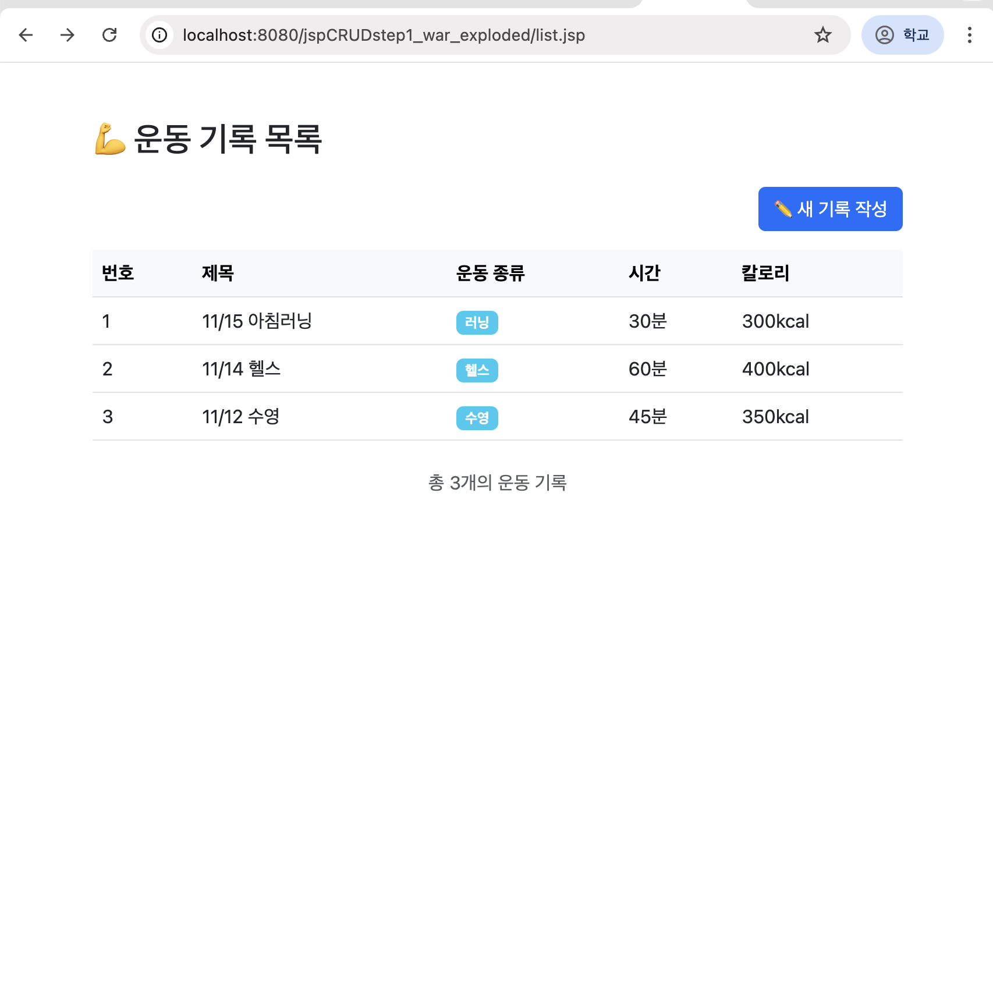
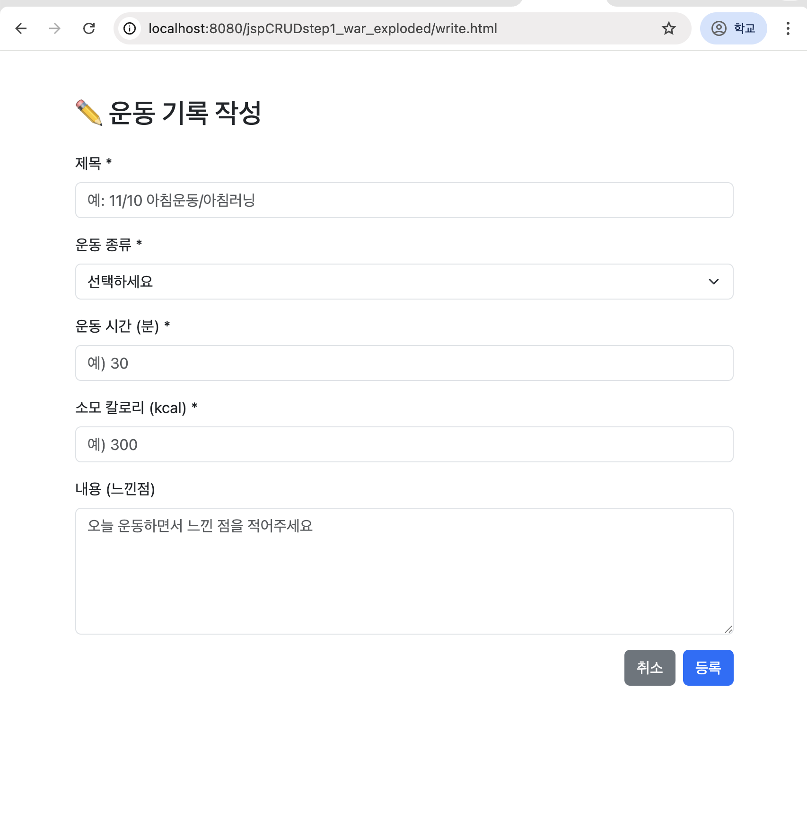
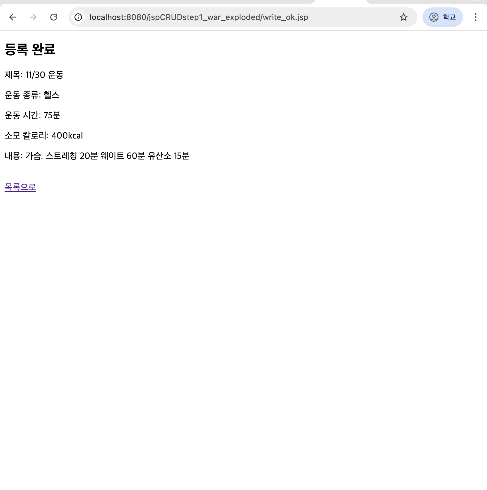
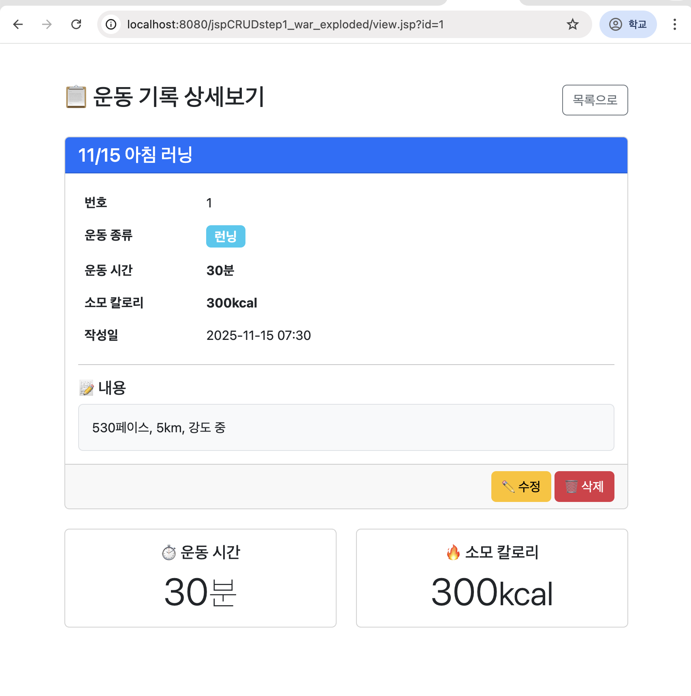
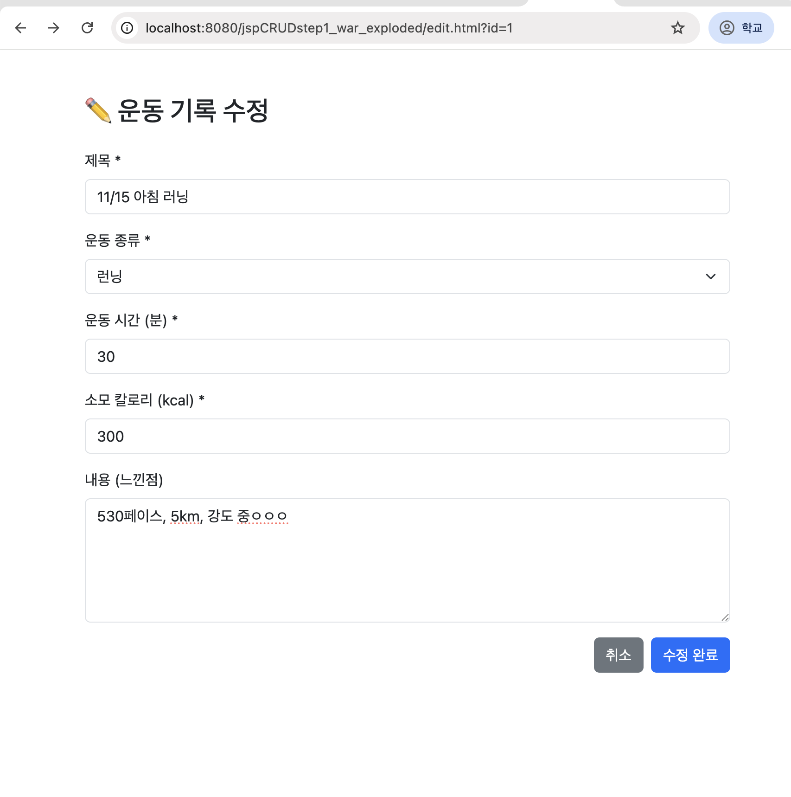
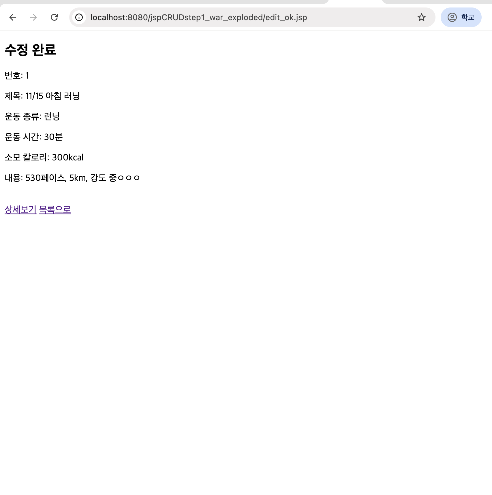
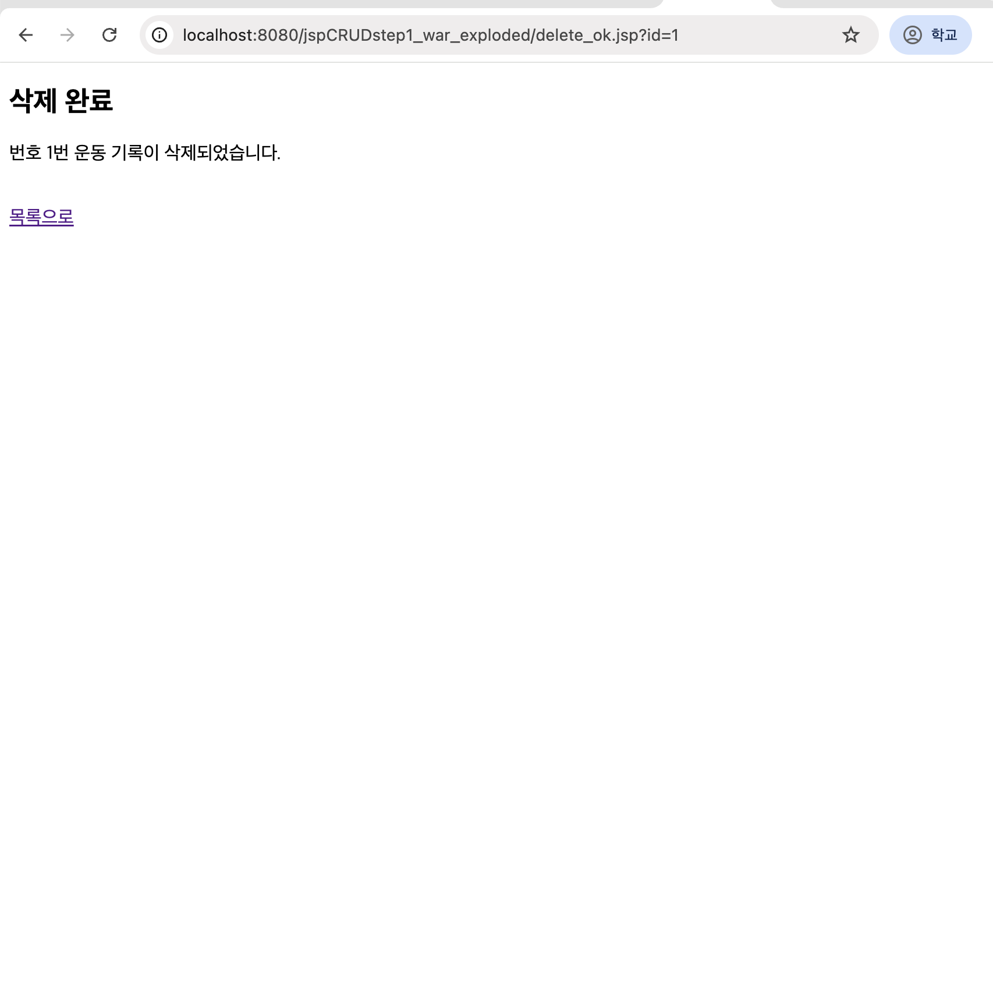

[](https://classroom.github.com/a/FTZBkejJ)

# 운동 기록 관리 시스템 (JSP CRUD)

JSP를 활용한 운동 기록 게시판 프로젝트입니다.

## 프로젝트 개요

- **주제**: 운동 기록 관리 시스템
- **기술 스택**: JSP, HTML, Bootstrap 5, Apache Tomcat 9
- **개발 기간**: 2025.11
- **개발자**: junhyoungSon

## 주요 기능

### CRUD 기능
- **Create**: 운동 기록 작성
- **Read**: 운동 기록 목록 조회 및 상세보기
- **Update**: 운동 기록 수정
- **Delete**: 운동 기록 삭제

### 데이터 항목 (5개)
1. **제목** (title) - 운동 기록 제목
2. **운동 종류** (type) - 런닝, 헬스, 수영, 요가, 사이클
3. **운동 시간** (duration) - 분 단위
4. **소모 칼로리** (calories) - kcal 단위
5. **내용** (content) - 운동 느낀점

## 기술 스택

- **Frontend**: HTML5, CSS3, Bootstrap 5
- **Backend**: JSP (Jakarta EE)
- **Server**: Apache Tomcat 9.x
- **Build Tool**: Maven
- **Version Control**: Git, GitHub

## 프로젝트 구조
```
jspCRUDstep1/
├── src/
│   └── main/
│       └── webapp/
│           ├── WEB-INF/
│           ├── list.jsp          # 목록 페이지
│           ├── write.html        # 작성 폼
│           ├── write_ok.jsp      # 작성 완료
│           ├── view.jsp          # 상세보기
│           ├── edit.html         # 수정 폼
│           ├── edit_ok.jsp       # 수정 완료
│           └── delete_ok.jsp     # 삭제 완료
├── images/                       # 스크린샷
├── pom.xml
└── README.md
```

## 화면 구성

### 1. 목록 페이지 (list.jsp)

- Mock 데이터로 운동 기록 목록 표시
- 새 기록 작성 버튼
- 행 클릭 시 상세보기로 이동

### 2. 작성 페이지 (write.html)

- 5개 필드 입력 폼
- Bootstrap을 활용한 반응형 디자인

### 3. 작성 완료 (write_ok.jsp)

- 입력한 데이터 단순 출력
- CSS 없이 텍스트만 표시

### 4. 상세보기 (view.jsp)

- Mock 데이터로 상세 정보 표시
- 수정/삭제 버튼 제공

### 5. 수정 페이지 (edit.html)

- Mock 데이터가 미리 채워진 폼
- 데이터 수정 후 제출

### 6. 수정 완료 (edit_ok.jsp)

- 수정된 데이터 단순 출력

### 7. 삭제 완료 (delete_ok.jsp)

- 삭제 확인 메시지

## 실행 방법

### 1. 요구사항
- Java 11 이상
- Apache Tomcat 9.x
- Maven

### 2. 프로젝트 실행
```bash
# 1. 프로젝트 클론
git clone https://github.com/csee-ps/project2-1-junhyoungSon.git

# 2. IntelliJ에서 프로젝트 열기
# File > Open > jspCRUDstep1 선택

# 3. Tomcat 서버 실행
# Run > Run 'Tomcat' 또는 Shift + F10

# 4. 브라우저에서 접속
http://localhost:8080/jspCRUDstep1_war_exploded/list.jsp
```

## 주요 특징

### Mock 데이터 사용
- DB 연결 없이 하드코딩된 테스트 데이터 사용
- list.jsp, view.jsp, edit.html에서 Mock 데이터 활용

### 단순 출력 페이지
- write_ok.jsp, edit_ok.jsp는 CSS 없이 데이터만 출력
- 과제 요구사항에 따른 심플한 구현

### Bootstrap 디자인
- 반응형 웹 디자인
- 모바일/데스크톱 모두 지원

## Git 관리

### GitFlow 전략
```
main
  └── develop
      ├── feature/list-page
      ├── feature/write-ok-page
      ├── feature/delete-page
      └── docs/readme
```

### Commit 규칙
- `feat`: 새로운 기능 추가
- `fix`: 버그 수정
- `docs`: 문서 수정
- `style`: 디자인 변경
- `refactor`: 코드 리팩토링
- `chore`: 설정 변경

## 개발 노트

### 배운 점
- JSP를 활용한 폼 데이터 처리
- Bootstrap을 사용한 반응형 웹 디자인
- GitFlow 브랜치 전략 실습
- Mock 데이터를 활용한 프론트엔드 개발

### 개선 가능한 점
- DB 연결하여 실제 데이터 저장
- Session을 활용한 데이터 관리
- AJAX를 통한 비동기 처리